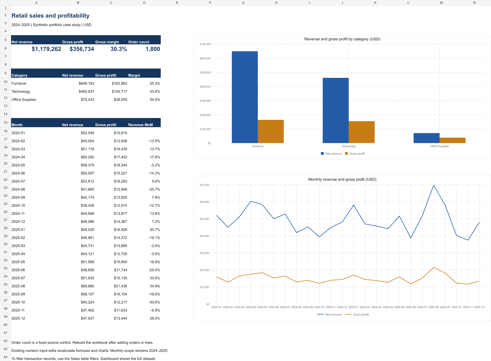

# Excel retail sales dashboard

A formula-driven sales workbook for reviewing category profitability and monthly performance, with a filterable transaction table and editable charts.

## Open the project

Download the repository ZIP, extract it and open **Retail_Analytics.xlsx** in Excel. No macros, external links or additional data connection are required.

## Workbook contents

- **Dashboard:** revenue, gross profit, weighted margin, a source order-count control, category comparisons, monthly results and two native charts.
- **Sales:** all 3,538 records, typed dates and numbers, filter buttons, frozen headers, and formula-based net revenue and gross profit. Loss-making lines are highlighted.

## Skills demonstrated

Excel tables, `IF`, `SUM`, `SUMIF`, `IFERROR`, relative and absolute references, monthly growth, weighted margin, conditional formatting, number formats and native charts linked to calculated ranges.

## How to explore

1. Compare category revenue with margin. Furniture leads revenue, while Office Supplies has the highest margin.
2. Inspect the monthly revenue series and month-over-month growth.
3. Filter the Sales table to Furniture and examine negative gross-profit rows.
4. In a disposable copy, increase a non-returned line's Gross sales by $100. Net revenue and gross profit should both rise by $100. Restore the input afterward.

The dashboard covers the entire dataset. Sales-table filters do not change its totals. Existing input edits recalculate, but formulas and charts are bounded to this 2024–2025 dataset. Adding records or years requires extending formula ranges and chart sources and updating the distinct-order control. The order count is labeled as a fixed source control.

## Validation

The workbook was opened in Microsoft Excel Desktop, with both charts rendered and worksheet gridlines hidden. The project owner confirmed running a full recalculation (Ctrl + Alt + F9); the subsequent screenshot shows the expected rounded dashboard totals unchanged, with no visible errors: $1,179,262 net revenue, $356,734 gross profit, 30.3% margin and 1,800 orders.

During workbook generation, formula recalculation and a representative $100 input change were also checked. Revenue and gross profit reconcile to independently computed SQL totals to the cent.

## Interpretation

Use category margin and revenue together. A high percentage on a small revenue base does not necessarily create the largest profit contribution. Monthly fluctuations are synthetic observations and are not a real seasonal forecast.

## Dataset and definitions

This is a synthetic learning project, not client work or evidence of real business impact. It uses seed 42 to generate 1,800 orders, 3,538 order lines, 200 customer records and six products across 2024–2025. All monetary figures are USD. Customer names are fictional placeholders. Order dates and purchase choices are randomized. These results describe this sample only.

- **Grain:** one order line. Order count uses distinct order IDs.
- **Net revenue:** quantity × unit price, less line discount, with returned lines set to zero.
- **Gross profit:** net revenue less retained-product cost. Returned lines reverse both revenue and cost, assuming full cost recovery.
- **Gross margin:** total gross profit / total net revenue. It is not the average of line margins.
- **Return rate:** returned lines / all lines, not returned orders / all orders.
- Excludes taxes, delivery fees, overhead, return handling and damaged inventory.

## Control totals

| Metric | Value |
|---|---:|
| Net revenue | $1,179,262.25 |
| Gross profit | $356,734.25 |
| Gross margin | 30.2506% |
| Distinct orders | 1,800 |
| Order lines | 3,538 |
| Returned lines | 186 |
| Loss-making lines | 61 |

## One case study, three tools

These three projects use the same fictional retail dataset to show different tools. Each repository can be explored independently.

- [SQL: customer and sales analysis](https://github.com/ashikiqbal-work/sql-retail-analysis)
- [Excel: sales dashboard](https://github.com/ashikiqbal-work/excel-sales-dashboard)
- [Power BI: profitability report](https://github.com/ashikiqbal-work/powerbi-profitability-report)
